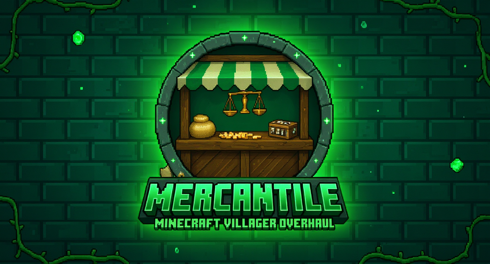

<p align="center">
  
</p>

<p align="center"><strong>Every villager remembers.</strong></p>

<p align="center">
  <a href="https://www.minecraft.net/"></a>
  <a href="https://fabricmc.net/"></a>
  <a href="LICENSE"></a>
  <a href="https://github.com/rfizzle/mercantile/releases"></a>
  <a href="https://github.com/rfizzle/mercantile/actions/workflows/ci.yml"></a>
</p>

A villager and trade overhaul for Minecraft 1.21.1 (Fabric). Mercantile turns
villagers from disposable trade machines into mobile, named, persistent
characters — with pickup, biome-themed names, a five-tier reputation system,
emerald-based trade cycling, and an iron-fueled sentry block that defends your
village. Vanilla-first design: no custom textures beyond the sentry pylon, no
balance-breaking shortcuts.

## Download

| [GitHub Releases](https://github.com/rfizzle/mercantile/releases) | [Website](https://mercantile.rfizzle.com) | [Report an issue](https://github.com/rfizzle/mercantile/issues) |
| --- | --- | --- |

## Features

- **Villager Pickup** — sneak-right-click a villager to pick it up. Full NBT
  (profession, trades, gossip, XP) is preserved on the held item.
- **Villager Names** — biome-themed names are auto-assigned on spawn and stay
  visible above every villager.
- **Trade Cycling** — refresh a villager's trade pool with emeralds and emerald
  blocks instead of breaking and replacing their workstation.
- **Reputation** — a five-tier global standing with persistent gossip that
  travels with villagers across the world.
- **Sentry Pylon** — an iron-fueled defense block that spawns temporary iron
  golems to guard your village.
- **Reputation HUD** — a compact on-screen tier readout shown next to nearby
  villagers, so you can read the room at a glance.

See the [full feature list](https://mercantile.rfizzle.com/features.html) on
the website for every behavior, tuning knob, and edge case.

## Installation

**Requirements**

- Minecraft 1.21.1
- Fabric Loader 0.16+
- Fabric API

**Steps**

1. Install [Fabric Loader](https://fabricmc.net/use/) for 1.21.1.
2. Drop [Fabric API](https://modrinth.com/mod/fabric-api) into your `mods/`
   folder.
3. Download `mercantile-<version>.jar` from
   [GitHub Releases](https://github.com/rfizzle/mercantile/releases) and drop
   it into `mods/` as well.
4. (Optional) Install [Mod Menu](https://modrinth.com/mod/modmenu) and
   [Cloth Config](https://modrinth.com/mod/cloth-config) to access the in-game
   settings screen.

Mercantile is required on the server. The HUD overlay is the only client-side
feature; install it on the client for the readout to appear.

## Optional integrations

Mercantile detects and integrates with these mods when present (none are
bundled):

- [Mod Menu](https://modrinth.com/mod/modmenu) — config screen entry
- [Cloth Config](https://modrinth.com/mod/cloth-config) — settings GUI
- [Jade](https://modrinth.com/mod/jade) /
  [WTHIT](https://modrinth.com/mod/wthit) — villager tooltip overlays
- [EMI](https://modrinth.com/mod/emi) /
  [REI](https://modrinth.com/mod/rei) /
  [JEI](https://www.curseforge.com/minecraft/mc-mods/jei) — recipe viewer
  support for trade-cycling recipes

## Links

- Website: <https://mercantile.rfizzle.com>
- Releases: <https://github.com/rfizzle/mercantile/releases>
- Issues: <https://github.com/rfizzle/mercantile/issues>
- Changelog: <https://mercantile.rfizzle.com/changelog.html>

## Part of Concord

Part of [Concord](https://github.com/rfizzle/concord) — a Vanilla+ collection.
Install any, combine all.

- [Meridian](https://meridian.rfizzle.com) — Chart your enchantments.
- [Tribulation](https://tribulation.rfizzle.com) — Survive what comes next.
- [Prosperity](https://prosperity.rfizzle.com) — Every chest, yours to discover.

## Building from source

```bash
git clone https://github.com/rfizzle/mercantile.git
cd mercantile
./gradlew build
```

The built jar lands in `build/libs/`. See [CLAUDE.md](CLAUDE.md) for the full
source layout, available Gradle tasks, and conventions.

## License

Licensed under the [MIT License](LICENSE). © 2026 rfizzle. Mercantile is not
affiliated with Mojang Studios or Microsoft.
